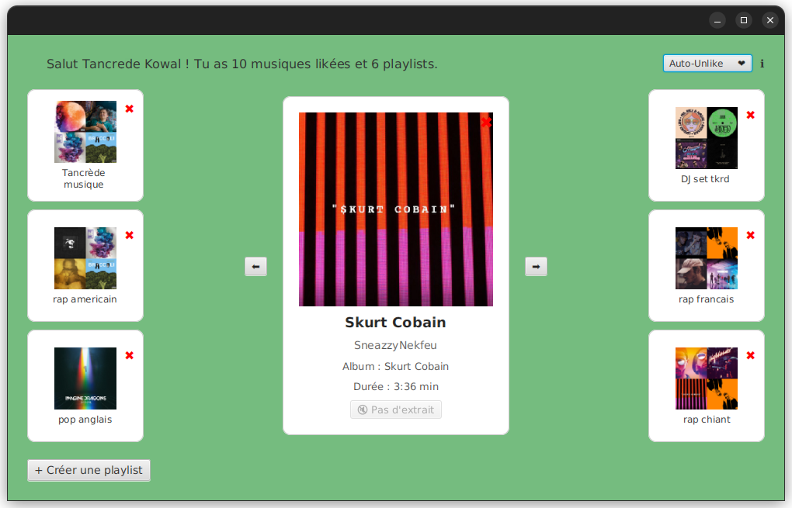

# 🎶 Sortify - Organisez vos musiques likées Spotify

Sortify est une application JavaFX qui vous permet de **trier et organiser vos musiques likées Spotify** via un système intuitif de glisser-déposer vers vos playlists.

> Fini le chaos dans vos titres likés : créez, triez, supprimez et organisez vos musiques favorites avec simplicité.

---

## 🧠 Fonctionnalités

- ✅ Connexion sécurisée à votre compte Spotify
- 🎵 Affichage visuel de vos titres likés (image, titre, artiste, album, durée)
- 📁 Visualisation de toutes vos playlists (gauche/droite)
- ➕ Création de playlists depuis l'app
- 🗑️ Suppression de playlists avec confirmation
- 🖱️ Drag & Drop de morceaux dans les playlists
- 🔁 Navigation entre les musiques avec flèches gauche/droite
- 🔊 Lecture d’un extrait 5 secondes (si disponible)
- ❌ Bouton croix pour retirer un morceau des titres likés
- 🔄 **Auto-Unlike** : supprime automatiquement un titre liké après ajout à une playlist (activable avec un switch)

---

## 🚀 Capture d'écran



---

## 🛠️ Installation

### 1. Pré-requis

- Java 21
- Maven
- Compte Spotify (avec droits suffisants)

### 2. Clonez le projet

```bash
git clone https://github.com/KTancrede/sortify.git
cd sortify
```

### 3. Lancement

```bash
mvn clean javafx:run
```

---

## 🔑 Configuration de l'API Spotify

L’application utilise l’API [Spotify Web API](https://developer.spotify.com/documentation/web-api/). Pour fonctionner, vous devez :

1. Créer une application sur le [Dashboard Spotify Developer](https://developer.spotify.com/dashboard/)
2. Ajouter cette URI de redirection :
   ```
   http://127.0.0.1:3000
   ```
3. Renseigner dans `SpotifyAuthManager.java` :
   ```java
   private static final String clientID = "VOTRE_CLIENT_ID";
   private static final String clientSecret = "VOTRE_CLIENT_SECRET";
   ```

---

## 🧰 Technologies

- Java 21
- JavaFX 21
- Maven
- Spotify Web API (via `spotify-web-api-java`)
- NanoHTTPD (pour la réception du code d'autorisation)
- GitHub pour la gestion du projet

---

## 📂 Arborescence simplifiée

```
.
├── src/
│   ├── main/
│   │   ├── java/
│   │   │   └── com/tancrede/spotifytinder/
│   │   │       ├── Main.java
│   │   │       ├── controller/
│   │   │       ├── model/
│   │   │       ├── player/
│   │   │       ├── spotify/
│   │   │       └── ui/
│   │   └── resources/
│   │       └── images/
│   │           ├── default_playlist.png
│   │           ├── logo.svg
│   │           └── screenshot.png
├── pom.xml
└── README.md
```

---

## 💡 Astuce de dev

- Pour forcer une nouvelle autorisation, supprime le token ou lance avec `show_dialog = true`.
- Le fichier `.gitignore` ignore les dossiers `target/` et `.settings/`.

---

## 🙏 Remerciements

- [Spotify Web API Java](https://github.com/thelinmichael/spotify-web-api-java)
- Icônes : [Google Fonts](https://fonts.google.com/icons), [FlatIcon](https://www.flaticon.com/)

---

## 📜 Licence

Ce projet est open-source sous licence MIT.

---

**Projet développé avec ❤️ par [Tancrède Kowal](https://github.com/KTancrede)**
